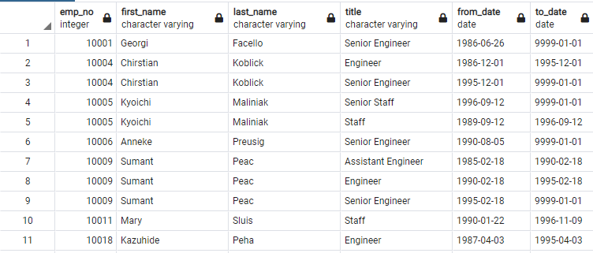
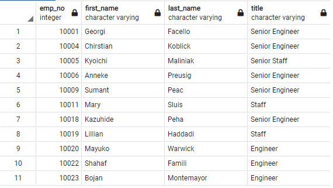
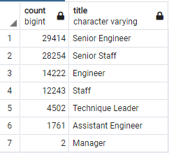
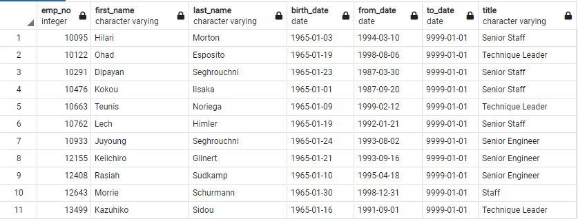

# Pewlett-Hackard-Analysis: finding statistics regarding retirement

## Overview
Pewlett-Hackard (PH) is expecting a large number of retirements from their company.  PH needs to know how many open positions they will expect to have in the years to come.  There is concern about losing expert knowledge and management wants to explore mentorship program options.  The analysis will be conducted in SQL from CSV files.

## Results
**Table 1:** All individuals close to retirement.  [Full Table](Data/retirement_titles.csv)

**Table 2:** All Individuals close to retirement getting most recent title.  [Full Table](Data/unique_titles.csv)

**Table 3:** Number of individuals by title close to retirement.  [Full Table](Data/retiring_titles.csv)

**Table 4:** All individuals eligible for the mentorship program.  [Full Table](Data/mentorship_eligibilty.csv)

- 14,222 engineers and 12,243 staff may soon retire. (see **Table 3**).
- 2 of the managers will be potentially leaving (see **Table 3**).
- 90,398 people may soon retire. (see **Table 3**).
- 1549 current employees will be eligible for the mentorship program (see **Table 1**). 

## Summary

- How many roles will need to be filled as the "silver tsunami" begins to make an impact?
  - 90,398 employees could be retiring in the near future. This seems unlikely because many employees do not have an active title and may no longer be employed at PH.  I will try to create tables with the people who have left removed. 
- Are there enough qualified, retirement-ready employees in the departments to mentor the next generation of Pewlett Hackard employees?
   - In the worst case scenario of 90,000 retirements there would not be enough mentors for all the new employees. The ratio would be near 60-1.

