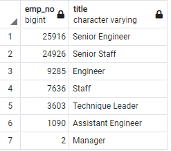

# Pewlett-Hackard-Analysis: finding statistics regarding retirement

## Overview
Pewlett-Hackard (PH) is expecting a large number of retirements from their company.  PH needs to know how many open positions they will expect to have in the years to come.  There is concern about losing expert knowledge and management wants to explore mentorship program options.  The analysis will be conducted in SQL from CSV files.
## Results
**Table 1:** All individuals close to retirement or retired by all titles held while at PH.  

**Table 2:** All Individuals close to retirement or retired with only their most recent title.  

**Table 3:** Number of individuals with each title currently close to retirement or retired.  

**Table 4:** All individuals that are currently employed and eligible for the mentorship program.  )

- 14,222 engineers and 12,243 staff may soon retire. (see **Table 3**).
- 2/9 of the managers will be potentially leaving (see **Table 3**).
- 90,398 people may soon retire. (see **Table 3**).
- 29,414 Senior Engineers may soon retire (see **Table 3**). 

## Summary

- How many roles will need to be filled as the "silver tsunami" begins to make an impact?
  - This is difficult to answer without first talking to management.  90,398 employees holding one of 7 different types of titles could be retiring in the near future, but that will only be the case if every employee in the employees data is still working for PH.  This seems unlikely as many employees do not have an active title.  Adding the where clause `AND (titles.to_date = '9999-01-01')` to the initial query for deliverable 1 to remove employees with no current title reduces the final retiring count to 72,458 from 7 titles (see **Table S1**).  In either case, an enormous number of employees will be retiring in the near future.
- Are there enough qualified, retirement-ready employees in the departments to mentor the next generation of Pewlett Hackard employees?
   - Assuming that PH has no desire to downsize and will be filling all vacant roles as older employees retire, then there are not enough eligible employees born in 1965. If every eligible mentor agreed to join the program, each mentor would have to mentor 58 new hires in the worst case scenario (90,000 retirements) or 46 new hires in the best care scenario (72,000 retirements).  However, if the eligibility of the program were extended 10 years (birthdays form 1960-1970), 93,756 individuals would be able to become mentors (see **Table S2**).  It is unlikely that all of these individuals would be willing to become mentors, but even if only a third of the candidates were interested, a ratio of approximately 1 mentor to 3 mentees in the worst case scenario is a doable workload for a parttime mentor.  The major remaining question regarding the feasibility of this program would be whether there are sufficient mentors from each department to cover the potential new hires form that department.  However, this may be better addressed when other questionable aspects of the data has been discussed with the boss.

**Supplemetal Table 1:** Number of individuals with each title currently close to retirement or retired with current titles.  [Full Table](Data/supplemental_1.csv)

**Supplemetal Table 2:** All individuals that are currently employed and eligible for the mentorship program if elligibility extended from 1960 to 1970.  [Full Table](Data/supplemental_2.csv)

